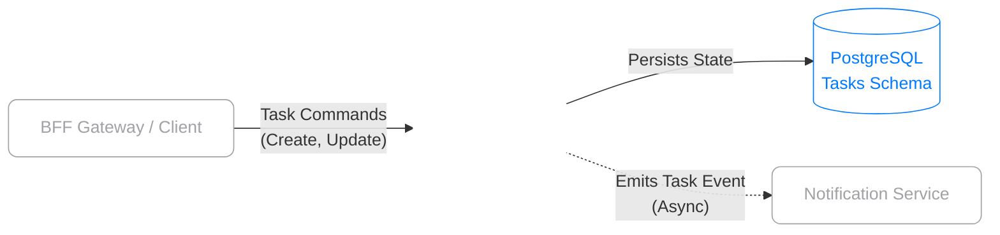

<div align="center">

  <!-- -->
  

  <h1><b>Task Orchestrator Service</b></h1>
  <p style="color: #A1A1A6;"><i>Core Engine for Cron Execution and Task Lifecycle Management</i></p>

  <a href="https://github.com/pedroforbeck/agendador-tarefas">
    <!--  -->
    
  </a>

  <br><br>

  <!-- Core Tech Stack  -->
  
  
  

  <br><br>

  <!-- Architecture Badges  -->
  
  
  

</div>

<br><br>

> **Abstract**<br>
> This repository contains the **Task Orchestrator Service**, acting as the primary domain engine for the ecosystem. It is responsible for managing the complete lifecycle of user tasks, executing automated background jobs via internal cron scheduling, and emitting state-change events to trigger downstream notifications.

<br>

##  Table of Contents

- [Service Architecture](#-service-architecture)
-[Core Capabilities](#-core-capabilities)
- [Deployment & Setup](#-deployment--setup)
-[API Endpoints Overview](#-api-endpoints-overview)

---

##  Service Architecture

This microservice receives validated commands from the BFF Gateway, persists task states, and autonomously emits asynchronous events to the Notification Service whenever a task changes its status (e.g., Pending to Completed).

<br>

<details>
<summary><b style="color: #A1A1A6; cursor: pointer;">View Component Topology (Glass/Wireframe Diagram)</b></summary>
<br>


</details>

---

##  Core Capabilities

| Feature | Description |
| :--- | :--- |
|  **Lifecycle Management** | Complete CRUD operations and state machine handling for scheduling entities. |
|  **Cron Execution** | Robust background job processing using Spring's scheduling annotations. |
|  **Event Emission** | Decoupled architecture that dispatches alerts when deadlines or completions occur. |
|  **Ownership Context** | Associates tasks securely to specific user IDs provided by the Gateway's JWT claims. |
|  **Data Isolation** | Maintains an independent PostgreSQL schema strictly for the task domain. |

---

##  Deployment & Setup

To run this microservice in isolation, ensure you have **Java 17+**, **Maven 3.8+**, and **PostgreSQL** installed.

### 1. Database Configuration
Create a dedicated database/schema in your PostgreSQL instance for this service (e.g., `db_agendador`).

### 2. Environment Variables
Configure your `application.properties` or `application.yml` with your local credentials. The required variables are:

```yaml
# Server Configuration
server.port: 8082

# Database Configuration
spring.datasource.url: jdbc:postgresql://localhost:5432/db_agendador
spring.datasource.username: your_postgres_user
spring.datasource.password: your_postgres_password
spring.jpa.hibernate.ddl-auto: update

# Microservice Routing (Event Emission)
service.notificacao.url: http://localhost:8083
```

### 3. Build & Execute
Navigate to the project root directory and start the Spring Boot application:

```bash
# Clone the repository
git clone https://github.com/pedroforbeck/agendador-tarefas.git

# Navigate to the directory
cd agendador-tarefas

# Run the application
./mvnw spring-boot:run
```

---

##  API Endpoints Overview

Although this service runs on `http://localhost:8082`, requests should ideally be routed through the BFF Gateway. Below are the primary domain endpoints exposed by this service:

| Method | Endpoint | Description |
| :--- | :--- | :--- |
| `POST` | `/tasks` | Creates a new scheduled task. |
| `GET` | `/tasks` | Retrieves all tasks owned by the requesting user. |
| `GET` | `/tasks/{id}` | Retrieves details of a specific task. |
| `PUT` | `/tasks/{id}` | Updates task information or state. |
| `DELETE`| `/tasks/{id}` | Removes a scheduled task. |

*(Note: Full interactive API documentation is accessible via Swagger UI when the service is running).*

---

<div align="center">
  <br>
  <p style="color: #A1A1A6;">Architected and maintained by <b><a href="https://github.com/pedroforbeck" style="color: #A1A1A6; text-decoration: none;">Pedro Forbeck</a></b>.</p>
  <p>
    <a href="https://github.com/pedroforbeck">
      
    </a>
    <a href="https://www.linkedin.com/in/pedroforbeck/">
      
    </a>
  </p>
</div>
